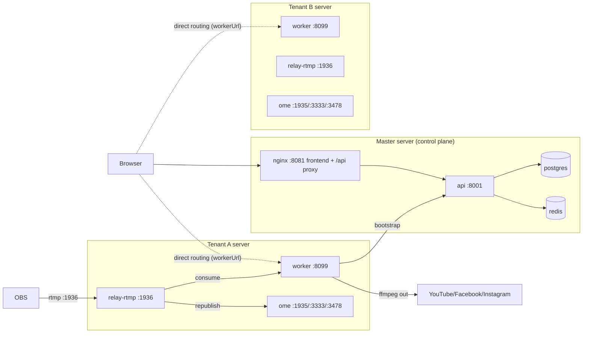

# Deployment Guide

How to deploy the Beamcast/OME restream platform in its multi-tenant (Model B)
layout: one **master (control plane)** server plus one or more **tenant
(streaming)** servers.

> Architecture and decision log: [`docs/multi-tenant-design.md`](docs/multi-tenant-design.md).
> Local development: [`DEVELOPMENT.md`](DEVELOPMENT.md).

---

## 1. Architecture overview



- **Master** runs the `server` + `frontend` profiles: auth, users, tenants,
  servers, plans, and the web app.
- **Tenant servers** run the `worker` profile: OME (origin), the RTMP relay,
  and the restream worker. Each tenant gets their own server (Model B); a
  worker only accepts its own tenant's users.
- The worker discovers its tenant at startup by POSTing to the master's
  `/api/servers/bootstrap` using a machine token.

### Docker Compose profiles

| Profile | Services | Runs on |
|---|---|---|
| `server` | `postgres`, `redis`, `api` | Master |
| `frontend` | `nginx` (built SPA + API proxy) | Master |
| `worker` | `ome`, `relay-rtmp`, `worker` | Tenant servers |
| `ingest-copy` | `ingester` (optional legacy copy path) | Tenant servers |

### 1.1 URL derivation reference

Where each URL comes from at deploy time:

| URL | Derived from | Where it's set |
|---|---|---|
| `worker_url` | manual | master `servers` table, at `POST /api/servers` |
| `ome_url` | manual | master `servers` table, at `POST /api/servers` |
| `ingest_url` (`rtmp://<host>:<port>/stream`) | `ingest_host` + `ingest_port` | computed by the API (`_server_dict`) from registration fields |
| `stream_key` (`input`) | constant | API response |
| relay `inputUrl` (`rtmp://127.0.0.1:1936/restream/input`) | `RELAY_INPUT_HOST` / `RELAY_INPUT_APP` / `RELAY_INPUT_STREAM_KEY` | worker `.env` (defaults `127.0.0.1:1936`, `restream`, `input`) |
| relay live-probe URL | `OBS_RELAY_HEALTH_URL` or the same `inputUrl` | worker `.env` |
| relay apps + pushes | hardcoded | `relay/nginx.conf` (`stream` → `ome:1935/app/key` + `127.0.0.1:1935/restream/input`) |
| OME WebRTC host | hardcoded | `conf/Server.xml` (`IceCandidate` / `TcpRelay`) — edit to each server's public IP |

Notes:

- **`worker_url` / `ome_url` are control-plane data, not worker env.** The
  frontend fetches them at login (`GET /api/servers/current`) and stores them as
  routing. Left empty, the frontend falls back to same-origin proxying through
  the master's nginx.
- **The relay `inputUrl` is loopback by default** — the worker and relay share a
  host, so OBS publishes to the *public* IP (`ingest_url`) while the worker
  consumes `127.0.0.1`. Once saved from the Settings UI, the persisted
  `inputUrl` in `worker/data/restream.db` overrides the env default.
- The `OME_RELAY_APP` / `OME_RELAY_STREAM_KEY` / `OME_RTMP_HOST` variables in
  `.env.example` are legacy — the worker always consumes the `restream/input`
  app defined in `relay/nginx.conf`.

---

## 2. Prerequisites

- Linux server (Ubuntu 22.04 tested), Docker + Compose v2 plugin, `git`.
- Public IP for every tenant server (RTMP + WebRTC need direct inbound access).
- `openssl` and `python3` on the host (used to generate secrets).

### Ports

| Port | Service | Role |
|---|---|---|
| `8001` | api (host) | control plane API |
| `8081` | nginx (host) | frontend + `/api` proxy |
| `1935` | ome | OME RTMP ingest (direct-to-OME, not used by OBS) |
| `1936` | relay-rtmp | **OBS RTMP ingest** (key `input`) |
| `3333` | ome | LL-HLS + WebRTC signalling |
| `3478` | ome | TcpRelay (WebRTC) |
| `10000-10010/udp` | ome | ICE candidates (WebRTC) |
| `8099` | worker (host net) | restream control API |

---

## 3. Deploy the master (control plane) server

### 3.1 Clone and checkout

```bash
git clone https://github.com/venus1344/stream-me.git ome
cd ome
git checkout feat/multi-tenancy   # or the release branch
```

### 3.2 Configure `.env`

Create `.env` (from `.env.example`). The **minimum required on the master**:

```bash
JWT_SECRET=<64-char random string>   # MUST be identical on every tenant server
JWT_EXPIRE_HOURS=24
POSTGRES_PASSWORD=<strong password>
```

> ⚠️ `JWT_SECRET` is shared with every tenant worker so user tokens issued by
> the master are accepted by all workers. Use a long random value and never
> rotate it without updating every tenant server.

Generate a secret:

```bash
openssl rand -hex 32
```

### 3.3 Start the stack

```bash
# Build the API image. If your provider TLS-inspects Docker bridge egress
# (Contabo does), include the host-network build override:
docker compose -f docker-compose.yml -f docker-compose.build.yml build api

# Start control plane + frontend
docker compose --profile server --profile frontend up -d --remove-orphans
```

### 3.4 Create the superuser (first install only)

The schema is created by `init_admin.py`, which **drops and recreates all
tables** — run it **once, on a fresh database only**:

```bash
docker compose exec api python init_admin.py admin@your-domain.com 'a-strong-password'
```

This creates the `Default` tenant and a `superuser`.

> On later deploys, `migrate_db()` runs automatically at API startup and is
> additive — it does **not** drop anything.

Verify the API is up and migrated:

```bash
curl -s http://127.0.0.1:8001/healthz
```

### 3.5 Register tenant servers

Log in as the superuser to get a JWT, then register each tenant server:

```bash
JWT=$(curl -s -X POST http://127.0.0.1:8001/api/auth/login \
  -H 'Content-Type: application/json' \
  -d '{"email":"admin@your-domain.com","password":"a-strong-password"}' \
  | python3 -c 'import sys,json;print(json.load(sys.stdin)["token"])')
```

```bash
curl -s -X POST http://127.0.0.1:8001/api/servers \
  -H "Authorization: Bearer $JWT" \
  -H 'Content-Type: application/json' \
  -d '{
    "name": "Contabo VPS 01",
    "server_id": "vps-contabo-01",
    "tenant_id": "<tenant-uuid>",
    "worker_url": "https://srv-01.stream.example.com",
    "ingest_host": "213.199.53.211",
    "ingest_port": 1936,
    "ome_url": "https://srv-01.stream.example.com"
  }'
```

> The response contains `serverToken` — it is shown **once**. Copy it; it goes
> into the tenant server's `.env`.

Create/assign tenants and set their plan:

```bash
# Assign an existing tenant to a server
curl -s -X POST "http://127.0.0.1:8001/api/servers/vps-contabo-01/assign?tenant_id=<tenant-uuid>" \
  -H "Authorization: Bearer $JWT"

# Set a tenant's plan (free | pro)
curl -s -X PATCH http://127.0.0.1:8001/api/tenants/<tenant-uuid>/plan \
  -H "Authorization: Bearer $JWT" \
  -H 'Content-Type: application/json' \
  -d '{"plan":"pro"}'
```

Plans (source of truth: `api/plans.py`):

| Plan | `max_destinations` | `max_video_bitrate_kbps` |
|---|---|---|
| `free` | 1 | 2500 |
| `pro` | 3 | 6000 |

---

## 4. Deploy a tenant (streaming) server

Each tenant server runs the `worker` profile. Two options below; both produce
the same result.

### 4.1 Prepare the host

```bash
git clone https://github.com/venus1344/stream-me.git ome
cd ome
git checkout feat/multi-tenancy
```

**Edit `conf/Server.xml`** and replace the hardcoded public IP
(`IceCandidate` / `TcpRelay`) with **this server's public IP** — required for
WebRTC playback:

```xml
<IceCandidate><THIS.SERVER.IP>:10000-10010/udp</IceCandidate>
<TcpRelay><THIS.SERVER.IP>:3478</TcpRelay>
```

### 4.2 Configure `.env`

```bash
JWT_SECRET=<SAME value as the master>       # REQUIRED — verifies user JWTs
SERVER_ID=vps-contabo-01                    # slug from POST /api/servers
SERVER_TOKEN=<token returned at registration>
API_URL=http://<master-ip>:8001             # control plane API
SECRET_ENCRYPTION_KEY=$(openssl rand -base64 32)   # AES-256-GCM field encryption
OME_HOST=<this-server-public-ip>
# destination keys (YOUTUBE_STREAM_KEY, …) are set later via the Settings UI,
# not required at bootstrap time.
```

> `TENANT_ID` is optional — leave empty and the worker will discover its tenant
> from the master at startup (`/api/servers/bootstrap`).

### 4.3 Start the streaming stack

```bash
# Convenience script (sets .env + builds + starts the worker profile):
scripts/provision-server.sh "$SERVER_ID" "$SERVER_TOKEN" "$API_URL" "$JWT_SECRET"

# …or manually:
docker compose -f docker-compose.yml -f docker-compose.build.yml build worker
docker compose --profile worker up -d
```

### 4.4 TLS edge (recommended for HTTPS routing)

Deploy `nginx/server-edge.conf` on the tenant server (adapt `server_name`,
cert paths, and `worker_url`/`ome_url` on the master's server record). It
serves `/api/restream/*`, `/api/clips/*` and OME `/app/*` over TLS, and lets
the frontend route to this server directly (`workerUrl`).

If no edge is deployed, leave `worker_url`/`ome_url` **empty** and the frontend
falls back to same-origin proxying through the master's nginx — fine for a
single-server pilot.

### 4.5 Verify bootstrap

```bash
docker logs ome-worker 2>&1 | grep -i bootstrap
```

(Container stdout is buffered; the message may not appear. Verify functionally
instead — see §5.)

---

## 5. Smoke tests

```bash
# Master health
curl -s http://127.0.0.1:8001/healthz

# Tenant worker health
curl -s http://127.0.0.1:8099/healthz

# Bootstrap contract (should return tenant_id + plan + limits)
curl -s -X POST http://127.0.0.1:8001/api/servers/bootstrap \
  -H 'Content-Type: application/json' \
  -d "{\"server_id\":\"$SERVER_ID\",\"token\":\"$SERVER_TOKEN\"}"
```

**Plan enforcement check** — the worker should clamp a bitrate above the plan
cap back down (free = 2500 Kbps):

```bash
JWT=<superuser token>
curl -s -X POST http://127.0.0.1:8099/api/restream/config \
  -H "Authorization: Bearer $JWT" -H 'Content-Type: application/json' \
  -d '{"youtubeVideoBitrateKbps": 6000}'
curl -s http://127.0.0.1:8099/api/restream/status \
  -H "Authorization: Bearer $JWT" \
  | python3 -c 'import sys,json;print(json.load(sys.stdin)["config"]["youtubeVideoBitrateKbps"])'
# → 2500 on free plan, 6000 on pro
```

---

## 6. OBS configuration

On the tenant server, point OBS at the relay (not directly at OME):

```
Server: rtmp://<tenant-server-ip>:1936/stream
Stream Key: input
```

The relay republishes to OME (`app/key` for playback) and exposes
`restream/input` to the worker, which probes that exact URL to decide live vs
offline.

---

## 7. Environment variables reference

| Variable | Where | Notes |
|---|---|---|
| `JWT_SECRET` | master + all tenants | **must match** |
| `JWT_EXPIRE_HOURS` | master | token lifetime |
| `POSTGRES_PASSWORD` | master | Postgres |
| `DATABASE_URL` / `REDIS_URL` | master | auto-derived in compose |
| `SERVER_ID` | tenant | slug from `POST /api/servers` |
| `SERVER_TOKEN` | tenant | machine token (shown once) |
| `API_URL` | tenant | master control-plane URL |
| `TENANT_ID` | tenant (optional) | static binding; else auto-discovered |
| `SECRET_ENCRYPTION_KEY` | tenant | base64 32 bytes; encrypts destination keys at rest |
| `OME_HOST` | tenant | public IP for WebRTC candidates |
| `RELAY_INPUT_*`, `OME_RELAY_*` | tenant | relay wiring (defaults are correct) |
| `YOUTUBE_*`, `FACEBOOK_*`, `INSTAGRAM_*` | tenant | destination defaults (can be set via UI) |

---

## 8. Backups & rollback

**Back up before any deploy** (code + database):

```bash
cd /root/apps
TS=$(date +%Y%m%d-%H%M%S)
mkdir -p "ome-backup-$TS"
tar czf "ome-backup-$TS/ome-code.tar.gz" ome
docker exec ome-postgres pg_dump -U beamcast -d beamcast -Fc \
  | cat > "ome-backup-$TS/beamcast.dump"
```

**Rollback:**

```bash
cd /root/apps
tar xzf ome-backup-$TS/ome-code.tar.gz      # restores the code
# restore the DB into a fresh postgres container if needed:
docker exec -i ome-postgres pg_restore -U beamcast -d beamcast --clean \
  < ome-backup-$TS/beamcast.dump
```

---

## 9. Troubleshooting

| Symptom | Cause / fix |
|---|---|
| Build fails with `CERTIFICATE_VERIFY_FAILED` | Provider TLS-inspects bridge egress. Build with `-f docker-compose.build.yml` (host networking). |
| Worker serves offline clip instead of live | OBS is pointed at OME (`:1935`) instead of the relay (`:1936`). Point OBS at `rtmp://HOST:1936/stream`. |
| `[bootstrap]` line missing from worker logs | stdout buffering — verify functionally via the clamp test in §5. |
| Admin console shows server `unknown` | Worker does not send heartbeats yet (cosmetic). |
| `migrate_db` not adding columns | Ensure the API container was restarted (lifespan hook runs it at startup). |
